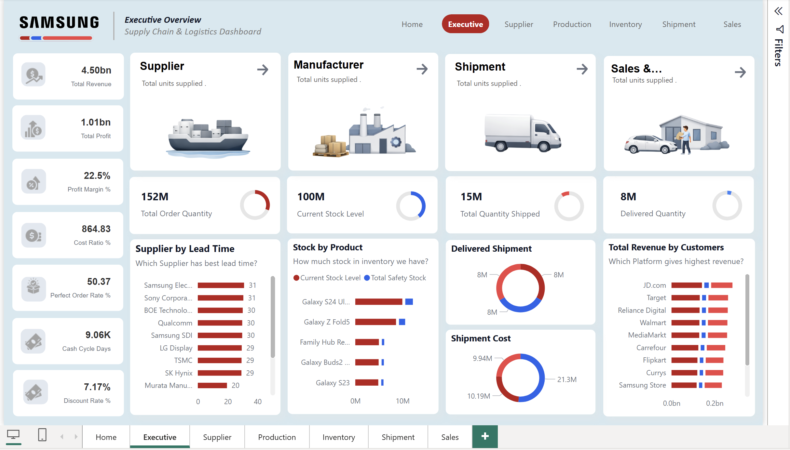
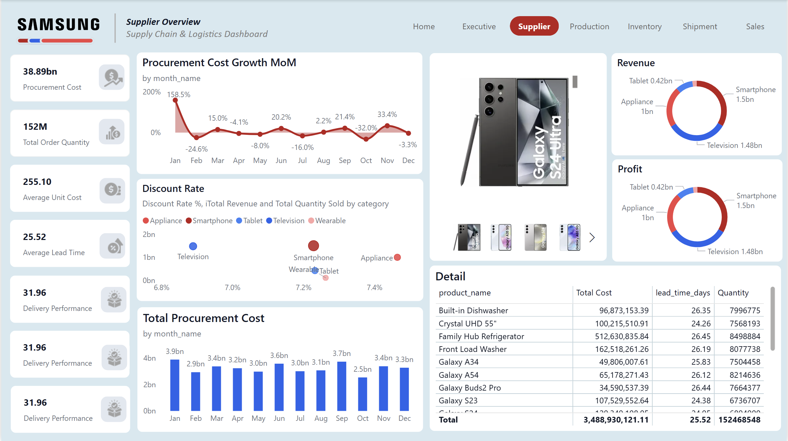
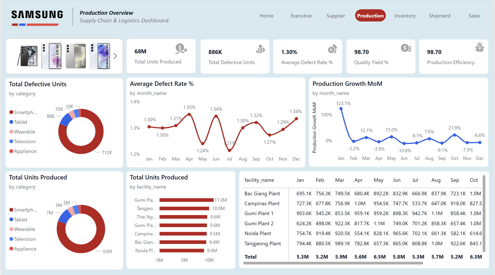
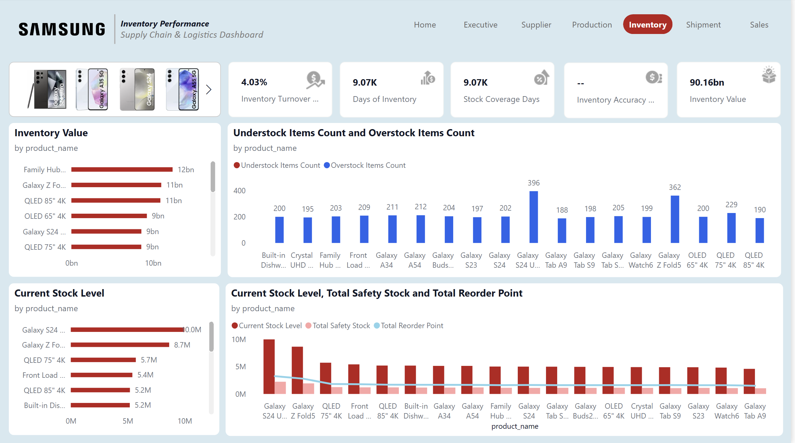
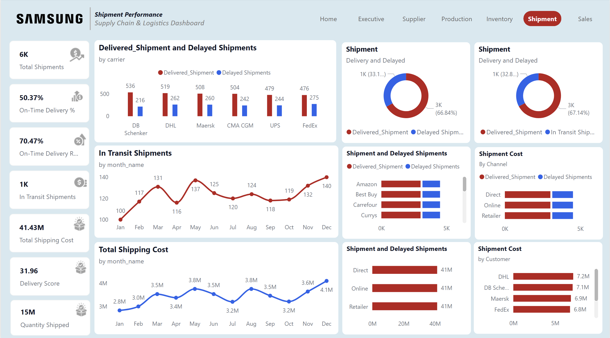
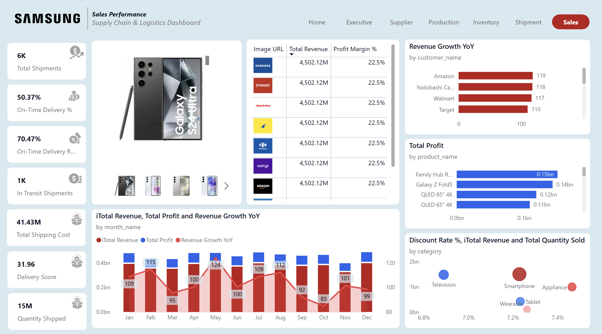

# End-to-End-Supply-Chain-Intelligence

# 📦 Enterprise Supply Chain & Operations Intelligence (Power BI)

A six-module enterprise analytics system integrating **Procurement, Production, Inventory, Logistics, and Sales** into a unified operational intelligence dashboard.  

Built to demonstrate applied skills in **data modeling, KPI engineering, operational analytics, and executive dashboard design** using Power BI.

---

## 📌 Table of Contents
- [Project Overview](#project-overview)
- [Executive Overview](#executive-overview)
- [Supplier Performance](#supplier-performance)
- [Production Operations](#production-operations)
- [Inventory Optimization](#inventory-optimization)
- [Shipment & Logistics](#shipment--logistics)
- [Sales Performance](#sales-performance)
- [Key Insights](#key-insights)
- [Skills Demonstrated](#skills-demonstrated)

---

## 📋 Project Overview

| Module | Focus Area | Objective |
|---|---|---|
| **Executive** | Enterprise KPIs | Financial & operational health |
| **Supplier** | Procurement analytics | Cost & lead time monitoring |
| **Production** | Manufacturing | Efficiency & quality tracking |
| **Inventory** | Working capital | Stock optimization |
| **Shipment** | Logistics | Delivery performance |
| **Sales** | Revenue analytics | Growth & profitability |

The dashboard simulates an enterprise manufacturing ecosystem, enabling real-time cross-functional decision-making.

---

## Executive Overview

Provides a consolidated enterprise-level snapshot of financial and operational performance.

**Headline Metrics:**
- Total Revenue: **4.5B+**
- Total Profit: **1B+**
- Profit Margin: **22.5%**
- Perfect Order Rate
- Cash Cycle Days
- Current Stock Level
- Delivered Quantity

**Insight:**
Executive-level metrics connect revenue performance with operational execution, highlighting how inventory levels, shipment performance, and procurement impact profitability.

---

## Supplier Performance

Analyzes procurement cost trends and supplier efficiency.

**Key Metrics:**
- Procurement Cost: **38.89B+**
- Average Unit Cost
- Average Lead Time
- Procurement Cost Growth (MoM)
- Discount Rate Impact by Category

**Insight:**
Lead time variability and cost growth patterns indicate supplier concentration risk and cost inflation exposure.

---

## Production Operations

Tracks manufacturing output and quality efficiency across facilities.

**Key Metrics:**
- Total Units Produced: **68M+**
- Total Defective Units: **886K**
- Average Defect Rate: **1.30%**
- Quality Yield: **98.7%**
- Production Growth MoM

**Insight:**
Even marginal increases in defect rates materially affect throughput and downstream shipment performance.

---

## Inventory Optimization

Monitors working capital efficiency and stock positioning.

**Key Metrics:**
- Inventory Turnover
- Days of Inventory
- Stock Coverage Days
- Inventory Value: **90B+**
- Understock vs Overstock Counts
- Safety Stock vs Reorder Point

**Insight:**
Simultaneous overstock and understock patterns indicate reorder misalignment and working capital inefficiencies.

---

## Shipment & Logistics

Evaluates delivery reliability and logistics cost control.

**Key Metrics:**
- Total Shipments
- On-Time Delivery %
- Delivery Score
- Total Shipping Cost: **41M+**
- Delivered vs Delayed Shipments
- Carrier Performance Comparison

**Insight:**
Carrier-level performance dispersion drives delivery score variability and impacts customer satisfaction.

---

## Sales Performance

Measures revenue growth and product-level profitability.

**Key Metrics:**
- Revenue Growth YoY
- Total Profit by Product
- Revenue by Customer
- Discount Rate Impact
- Revenue vs Profit Trends

**Insight:**
Revenue growth varies significantly by customer and category, while discount elasticity impacts margin sustainability.

---

## 💡 Key Insights

1. **Operational efficiency drives financial outcomes** — Production and shipment reliability directly affect revenue realization.
2. **Inventory misalignment signals capital inefficiency** — Reorder calibration requires optimization.
3. **Procurement volatility impacts margin stability** — Supplier performance must be continuously monitored.
4. **Carrier dispersion creates service variability** — Logistics performance directly affects customer-level revenue trends.
5. **Cross-functional integration is essential** — Viewing procurement, production, inventory, and sales in isolation hides systemic risk.

---

## 🧠 Skills Demonstrated

- Enterprise BI Architecture  
- Star Schema Data Modeling  
- DAX-Based KPI Engineering  
- Operational Performance Analytics  
- Supply Chain Optimization Framework  
- Executive Dashboard Design  
- Cross-Functional Data Integration  
- Business Performance Storytelling  

---

This project demonstrates the ability to design and implement an enterprise-level operational analytics system connecting finance, manufacturing, logistics, and sales into a unified decision-support platform.
